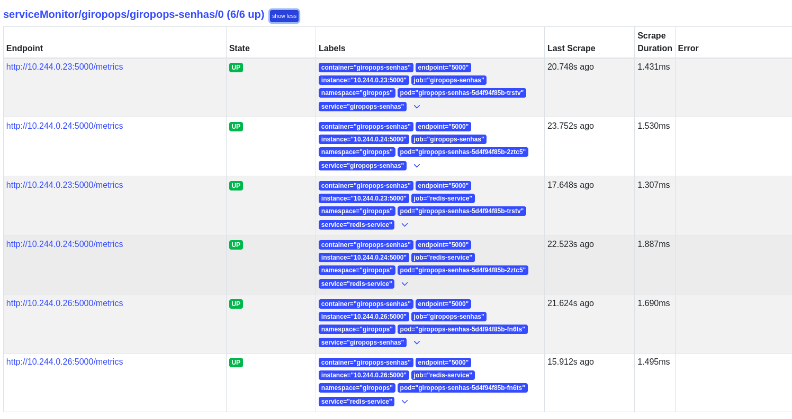
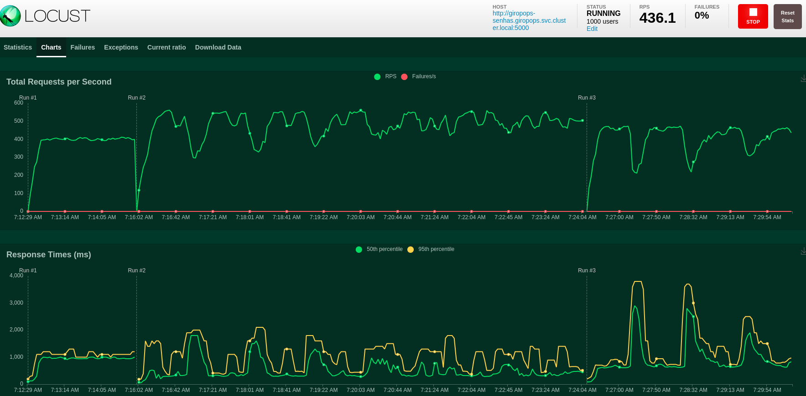

# Giropops Senhas

This is a password generator application created by Linuxtips. The challenge is to put this into a kubernetes cluster with all we learned in PICK (Programa Intensivo de Containers e Kubernetes).

### Summary

- [Requirements](#requirements)
- [Docker images](#docker)
- [Push images to DockerHub](#dockerhub)
- [Report of image vulnerabilities on readme](#trivy-report)
- [Signed images](#verify-image-signature)
- [Kube-linter](#kube-linter)
- [KinD Cluster](#create-kind-cluster)
- [Run cluster in OKE](#run-cluster-in-oke)
- [Monitoring with Prometheus](#monitoring-with-prometheus-and-grafana)
- [Performance Test - Locust~~](#hpa-and-locust)

## TODO

- [ ] Automation with GitHub Actions Deploying application in OKE
- [ ] Cert Manager
- [ ] Complete Documentation on readme file
- [ ] Fix Service and Pod Monitors not working in OKE
- [ ] Sign Locust image and reduce its size

## Requirements

- [docker](https://docs.docker.com/engine/install/)
- [trivy](https://aquasecurity.github.io/trivy/v0.18.3/installation/)
- [kind](https://kind.sigs.k8s.io/docs/user/quick-start/#installation)
- [kubectl](https://kubernetes.io/docs/tasks/tools/#kubectl)
- [kube-linter](https://github.com/stackrox/kube-linter#installing-kubelinter) (optional)
- [ingress](https://docs.nginx.com/nginx-ingress-controller/installation/installing-nic/installation-with-manifests/)
- [kube-prometheus](https://github.com/prometheus-operator/kube-prometheus)
- [terraform](https://developer.hashicorp.com/terraform/install)
- [oci-cli](https://docs.oracle.com/en-us/iaas/Content/API/SDKDocs/cliinstall.htm#InstallingCLI)

## Docker

I've used the [wolfi images from Chainguard](https://www.chainguard.dev/chainguard-images), to build the application with python and use its redis image.

We can test them locally with docker compose:

    docker compose up

## DockerHub

Log into docker in the terminal (use your username):

    docker login -u mmazoni

Push the image you created:

    docker push mmazoni/linuxtips-giropops-senhas:3.0

## Trivy Report

The wolfi image for python has no vulnerabilities, only the python libs have vulnerabilities, updating the libraries into the fixed versions make the image with 0 vulnerability.

### Before

### After

## Verify Image Signature

Install [cosign](https://docs.sigstore.dev/system_config/installation). Then, we can give the command to verify the signature:

    cosign verify --key=dockerfile/cosign.pub mmazoni/linuxtips-giropops-senhas:3.0

## Kube-linter

Kube-linter is configured (GitHub Actions) to run when merging/pushing to `main` branch. You can run locally too, if you want:

    kube-linter lint manifests/ --config .kube-linter.yml

## Local Hosts configuration

Edit the hosts to the application work with ingress.

    sudo vim /etc/hosts

Then, add the hosts necessary for the project:

    127.0.0.1    giropops-senhas.kubernetes.local
    127.0.0.1    grafana.kubernetes.local
    127.0.0.1    prometheus.kubernetes.local
    127.0.0.1    alertmanager.kubernetes.local

## Create KinD cluster

1. Install [kind](https://kind.sigs.k8s.io/) to use Kubernetes in Docker locally and kubectl to work with kubernetes API through your terminal.

2. Use this command to create the cluster:

    kind create cluster --config=config/kind/cluster.yml

### Apply the manifests

    kubectl apply -k manifests/overlays/kind
    kubectl apply -f manifests/overlays/kind/specific

2. See if all pods is running, then access the application

    kubectl get pods -n giropops

* http://giropops-senhas.kubernetes.local/
* http://grafana.kubernetes.local
* http://prometheus.kubernetes.local

## Run cluster in OKE

1. Authenticate in OCI following this guide here: https://github.com/Rapha-Borges/oke-free

2. Then create the infrastructure with Terraform:

    terraform init
    terraform apply

3. After that, you cluster will be created and you already connected to it. All the necessary manifests should be applied too.

4. See if it is working:

    kubectl get nodes

Now, you can access `giropops-senhas` by the public ip that Terraform shows as output after finishing the provisioning.

http://<public_ip>

## Monitoring with Prometheus and Grafana

1. We will use the [kube-prometheus](https://github.com/prometheus-operator/kube-prometheus) to start monitoring `giropops-senhas`. Now, install the CRDs(Custom Resource Definitions) of kube-prometheus:

    git clone https://github.com/prometheus-operator/kube-prometheus ~/kube-prometheus
    cd ~/kube-prometheus
    kubectl create -f manifests/setup

2. Then, install the services (Prometheus, Grafana, Alertmanager, Blackbox, etc)

    kubectl apply -f manifests/

3. Check if everything installed properly:

    kubectl get servicemonitors -n monitoring
    kubectl get pods -n monitoring

## Apply the manifests

Access here: http://prometheus.kubernetes.local/targets?search=

#### Service Monitor

#### Pod Monitor

## HPA and Locust

1. This part we will configure the HorizontalPodAutoscaler and use Locust for the stress testing. First, a requirement of HPA is the Metric Server:

    kubectl apply -k manifests/base/oke

2. See if it's installed and wait for the :

    kubectl get pods -n kube-system | grep metrics-server

Now we can obtain CPU and memory metrics from nodes and pods

    kubectl top nodes
    kubectl top pods

3. Access the http://<public_ip>:3000
Set the users as 1000 and the rate per second as 100.

Here is the pods resource monitoring in Grafana:

